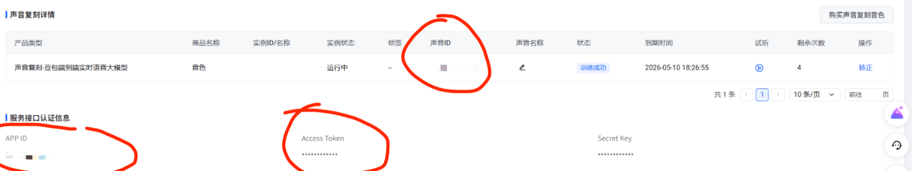

# ChatAnon
Version: V0.0.2 -- 2025.12.6

## 更新日志
V0.0.3 -- 2025.12.6
- 增加文本模式支持，方便调试和开发
- 修复文本模式下服务端异常响应导致的崩溃问题
V0.0.2 -- 2025.12.6
- 增加logger输出，方便调试
- 上传README教程，补充中文版本README_zh.md

## 简介
该项目为一个基于豆包端到端语音大模型的虚拟角色聊天代理，使用语音克隆功能克隆千早爱音的音色，用户可通过麦克风与该角色进行语音交互。

效果演示视频见[这里](https://www.bilibili.com/video/BV1u6SJBhEbZ/)。


## 使用教程
### 0.准备工作
在执行下面步骤前，请先在火山引擎注册账号并在控制台[开通豆包端到端实时语音大模型](https://console.volcengine.com/speech/service/10017)

详细步骤可参考[火山引擎官方文档](https://www.volcengine.com/docs/6561/1594356?lang=zh)。

记录红圈处的信息，用于后续配置。

### 1.语音克隆
进入train目录下，新建credentials.py，填写火山引擎的AppID、API Token和Speaker ID。
```python
# 敏感配置信息，请勿提交到版本控制
appid = "your_appid_here"
token = "your_token_here"
spk_id = "your_spk_id_here"
```
执行uploadAndStatus.py进行训练
### 2.Agent交互
进入agent目录下，新建credentials.py，填写火山引擎的AppID、API Token和Speaker ID。
```python
# 敏感配置信息，请勿提交到版本控制
appid = "your_appid_here"
access_key = "your_token_here"
speaker_id = "your_spk_id_here"
```
执行main.py启动Agent，即可正常进行语音交互，按下空格键可切换麦克风开启/关闭状态。

# References
[1] “〖MyGO人物简析〗千早爱音——伟大的普通人,” Bilibili. [Online]. Available: https://www.bilibili.com/opus/853331683253944352
. [Accessed: Nov. 30, 2025].